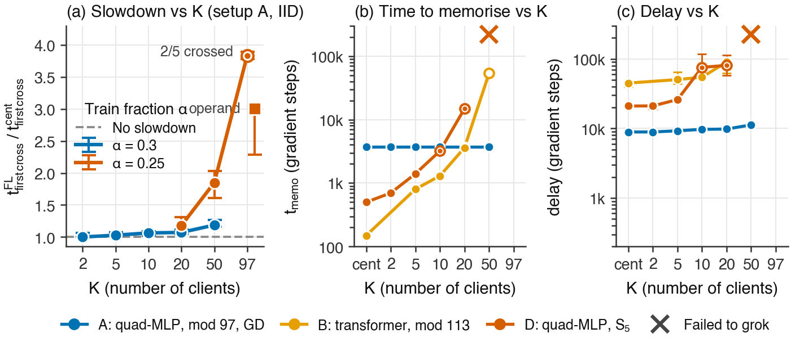

# Grokking under federated learning

Does **grokking** — a model memorising its training set, looking stuck for a long
time, then abruptly generalising — survive when training is split across many
clients that only ever average their weights?

This repository holds the code, every run, and the analysis behind a study of that
question across six model/task setups and the FedAvg family, built on
[Flower](https://flower.ai). Short answer: federation does not break grokking, it
delays it, and the delay has a structure — memorisation slows with the number of
clients while the memorise-to-generalise gap stays flat — with one real exception
where federated training drives a model into a stable state that memorises
perfectly and never generalises.



*Figure 1. Federation costs `t_memo(K) + delay`. Left: grokking time relative to
centralised training as the number of clients K grows. Middle and right: the two
clocks separately — time to memorise rises with K, the delay before generalisation
does not.*

## Key findings

- **Federation delays grokking and does not break it.** At one local epoch FedAvg is
  an algebraic identity with centralised gradient descent (`tests/test_fedavg_identity.py`),
  so the interesting axes are client count K, local epochs E, participation f, and
  how the data is partitioned. Ten times the clients costs about 16% more training
  time on the anchor task.
- **The cost decomposes into two clocks.** Memorisation time grows with K; the
  delay between memorising and generalising is roughly flat. Budgets set as a
  multiple of the centralised grokking time under-provision exactly the high-K
  cells: seven of the nine "breakdowns" this project reported dissolved on
  re-measurement as clocks running out, an eighth as shard starvation. `t_memo`
  is recorded next to `t_grok` for that reason.
- **One breakdown is real.** Setup D at E = 50 local epochs reaches 100% train
  accuracy by step 3,000 and sits at 80–83% test for two million steps, with
  weight norm and per-round drift stationary and train loss never below 0.055: a
  fixed point with the gradient alive, not a clock running out.
- **How you partition matters more than how far you fragment.** Coherent shards
  (each client holding one operand) grok sooner than random shards on the anchor
  and on setup C (1.9×), and at 97 clients on the anchor they grok where random
  shards mostly do not (5/5 against 2/5); the effect is absent on B and D, and
  incoherent structure (sharding by target) is the worst partition everywhere.
  The mechanism is visible early: per-neuron spectral concentration separates the
  coherent and random arms thousands of rounds before either crosses the bar.
- **Unstructured heterogeneity mostly does not matter.** A Dirichlet label skew over
  five orders of magnitude costs the anchor at most 9%; the apparent failure at the
  most skewed setting tracks the smallest shard, seed for seed, and is starvation,
  not heterogeneity. Where heterogeneity does bite, it attacks a different phase
  per architecture: transformers stop memorising, the quadratic MLP memorises and
  stops generalising.
- **Partial participation is free per communication round** on every setup except
  MNIST, and it is the clean test that sampling noise does not delay grokking while
  systematic client disagreement does.
- **Local work scales differently by architecture.** On transformers the cost of
  memorisation grows linearly with E at matched compute; on full-batch quadratic
  MLPs it is flat.
- **Adaptive server optimisers are 10–20× faster than FedAvg on the hard cells**
  with every method at its own tuned learning rate; SCAFFOLD cuts client
  divergence and speeds grokking, FedProx cuts divergence and never groks, so drift
  magnitude is neither necessary nor sufficient.
- **The optimiser is a control variable.** The identical network on the identical
  data groks 45× sooner under AdamW than under Gromov's full-batch GD, and the
  training-fraction cliff moves with it.

The numbered ledger with every measurement, the run ids behind it, and the
claims that were withdrawn is [`RESULTS.md`](RESULTS.md). One caveat carried
throughout: the Flower/Ray harness is not run-to-run deterministic (float
summation order in aggregation), which is harmless on most setups and decisive on
setup C near its threshold, so quantitative claims on C are withheld
(`RESULTS.md` §23).

## The setups

| Setup | Task | Model | Optimiser, weight decay | Grok bar |
|---|---|---|---|---|
| **A** (anchor) | (n + m) mod 97, one-hot, MSE | two-layer quadratic MLP (Gromov 2023) | full-batch GD, lr 50, wd 0 | 95% |
| **A′** | same | same | AdamW | 95% |
| **B** | (n + m) mod 113, cross-entropy | one-layer transformer (Nanda et al. 2023) | AdamW, wd 1.0 (0.1 for new work) | 95% |
| **C** | S₅ composition, cross-entropy | transformer | AdamW, wd 1.0 (0.1 for new work) | 85% |
| **D** | S₅ composition, cross-entropy | quadratic MLP | AdamW, wd 1.0 | 85% |
| **E** | MNIST-1k, MSE (Omnigrok) | ReLU MLP with scaled init | AdamW, wd 0.1 | 90% |

Every setup is trained centralised and under FedAvg with K ∈ {2, 5, 10, 20, 50}
clients (97 on the anchor), E ∈ {1, 5, 10, 25, 50} local epochs, participation
f ∈ {0.2 … 1}, IID / operand / target / coset / label-block / Dirichlet partitions,
and FedAvg, FedAdam, FedYogi, FedAvgM, FedProx and SCAFFOLD on the anchor. The
grok bar is a dataset property and is stored per run.

## What is in the repository

```
src/fedgrok/
  core/        Config + FedConfig dataclasses, model/loss registry, guards
  data/        modular arithmetic, S_n composition, MNIST-1k; partitioners
  models/      GrokNet (quadratic MLP), Nanda transformer, ReLU MLP
  training/    centralised loop, Flower/Ray federated loop, SCAFFOLD, runner
  metrics/     Fourier/IPR, S_n isotypic decomposition, quadratic-circuit split
  analysis/    t_grok / t_memo detection, censored-survival statistics
  manifest.py  spec -> config, content-hash run ids, grid expansion
  run.py       single-run entry point, atomic result JSON

manifests/           every experiment, declared as JSONL run specs
scripts/             build_manifests, validate_manifest, launch_sweep, collect_runs,
                     summarize_runs, backfill_runs, package_checkpoints, ...
scripts/plotting/    paper_figures (the figure set), run_atlas, grok_curves, ...
paper/               figures.tex and paper/figures/ (fig1-7, A1-A2, PNG + PDF)
results/data/        runs_v2.csv (1,685 runs) and the per-run result rows
results/runs/        per-round training history and spec for every run
tests/               the suite; ~9 min with the Flower/Ray integration tests
RESULTS.md           the ledger: every number, with the runs behind it
PROGRESS.md          what is built, how it is run, decisions worth not re-deriving
RUNS_TODO.md         what remains and what was decided against
plans/               the campaign plans (closed ones under plans/closed/)
```

`run_experiment.py` and `experiments/` are the v1 single-setup study (870 runs,
tag `v1-single-setup`). They predate the manifest system and nothing in `src/`,
`scripts/` or `tests/` uses them.

## Data

Three layers, from small to large:

1. **The run table**, `results/data/runs_v2.csv`: one row per run with every config
   field and outcome (`t_memo`, `t_first_cross`, `t_grok`, `grokked`, `censored`,
   final accuracies, IPR). The ground truth; the prose lags it.
2. **Per-round histories**, `results/runs/<run_id>/history_*.json`: train/test
   loss and accuracy, weight norms, client drift and divergence at every logging
   step, so any curve in the paper can be re-plotted from a clone.
3. **Model checkpoints and per-client weights** (40 GB, 664 runs), on Hugging Face
   at [FedGrok/fedgrok-checkpoints](https://huggingface.co/datasets/FedGrok/fedgrok-checkpoints),
   gated with automatic approval. One uncompressed tar per campaign group, filed by
   the paper axis it supports; the `group` column of the run table is the join key,
   and the dataset's `MANIFEST.csv` maps each group to its path and figure. Runs with
   `checkpoint_every = 0` (the strategy comparison, setup A's local-epoch ladder,
   most centralised anchors) have histories but no weights.

A run id is a content hash of its config, so it is the same in the table, on disk
and in the checkpoint archives.

## Reproduce

```bash
python3.10 -m venv venv && venv/bin/pip install -e ".[dev]"   # pins in pyproject.toml
venv/bin/python -m pytest tests -q -k "not Fed and not fed and not integration"   # ~45 s
```

Experiments are manifests, not command lines. Re-running a manifest executes only
the runs whose result row is missing:

```bash
venv/bin/python scripts/build_manifests.py                      # regenerate manifests/
venv/bin/python scripts/validate_manifest.py manifests/t5_local_epochs.jsonl
venv/bin/python scripts/launch_sweep.py manifests/t5_local_epochs.jsonl --gpus 0 --per-gpu 4
venv/bin/python scripts/collect_runs.py                         # -> results/data/runs_v2.csv
venv/bin/python scripts/summarize_runs.py results/data/runs_v2.csv --group setup,num_clients
python3 scripts/plotting/paper_figures.py                       # -> paper/figures/
```

Every manifest builder in `scripts/build_manifests.py` carries its decision rule
in its docstring. Runs assume CUDA; the launcher pins one GPU per subprocess. Wall
clock is orchestration-bound (each client is a Ray actor with its own CUDA
context), so cost scales with client count, not training length. Two environment
variables trade wall clock for memory without changing what is computed:
`FEDGROK_GPU_CLIENT_CAP=8` (clients holding a context at once) and
`FEDGROK_CLIENT_CPU=1` (clients train on CPU). The measured guidance is in
`PROGRESS.md` under *Concurrency*.

## Conventions

- **Two clocks.** `t_memo` is the first step at which train accuracy holds the bar;
  `t_first_cross` the first step test accuracy reaches it; `t_grok` the first step
  after which it never drops below. `delay = t_first_cross − t_memo`. Compare
  `t_first_cross` across budgets or logging rates: `t_grok` depends on how long the
  run continued.
- **Censoring.** Runs that do not grok within budget are right-censored, never
  dropped and never recorded as infinity. Headline numbers are Kaplan–Meier medians
  with bootstrap 95% intervals over seeds, alongside the fraction of seeds that
  grokked, which is the honest headline whenever a cell is partly censored.
- **Budgets** are set as `t_memo(K) + delay`, never as a multiple of the
  centralised grokking time.

## Citation

If this work is useful, please cite it (see [`CITATION.cff`](CITATION.cff)):

```bibtex
@misc{fedgrok2026,
  title  = {Grokking under federated learning: two clocks, partition structure, and a memorising fixed point},
  author = {He, Matteo and Elcock, James},
  year   = {2026},
  url    = {https://github.com/helpmatteo/federated_learning_grokking}
}
```

## License

Code is released under the MIT License (see [`LICENSE`](LICENSE)). The run table,
histories and checkpoints are released under the same terms.

## References

- Gromov, A. (2023). *Grokking modular arithmetic.* arXiv:2301.02679
- Nanda, N., Chan, L., Lieberum, T., Smith, J., Steinhardt, J. (2023). *Progress measures for grokking via mechanistic interpretability.* ICLR.
- Liu, Z., Michaud, E. J., Tegmark, M. (2023). *Omnigrok: grokking beyond algorithmic data.* ICLR.
- Stander, D., Yu, Q., Fan, H., Biderman, S. (2023). *Grokking group multiplication with cosets.*
- McMahan, H. B. et al. (2017). *Communication-efficient learning of deep networks from decentralized data.* AISTATS.
- Karimireddy, S. P. et al. (2020). *SCAFFOLD: stochastic controlled averaging for federated learning.* ICML.
- Beutel, D. J. et al. (2020). *Flower: a friendly federated learning research framework.*
